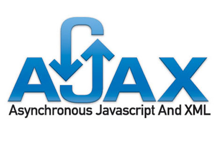

# AJAX
My works related to AJAX.

## Table of Contents
1. [Introduction.](#introduction)
2. [Official references websites.](#references)
3. [GitHub notes.](#github)

<a name="introduction"></a>
## 1. Introduction.
 
AJAX stands for Asynchronous JAvaScript and XML. AJAX is a technique for creating better, faster, and more interactive web applications with the help of XML, HTML, CSS, and Java Script. With Ajax, web applications can send and retrieve data from a server asynchronously (in the background) without interfering with the display and behavior of the existing page. By decoupling the data interchange layer from the presentation layer, Ajax allows web pages and, by extension, web applications, to change content dynamically without the need to reload the entire page. In practice, modern implementations commonly utilize JSON instead of XML. Ajax is not a single technology, but rather a group of technologies. HTML and CSS can be used in combination to mark up and style information. The webpage can then be modified by JavaScript to dynamically display—and allow the user to interact with—the new information. The built-in XMLHttpRequest object, or since 2017 the new "fetch()" function within JavaScript, is commonly used to execute Ajax on webpages allowing websites to load content onto the screen without refreshing the page. Ajax is not a new technology, or different language, just existing technologies used in new ways.

<a name="references"></a>
## 2. Official references websites. <br />
AJAX by Mozilla : https://developer.mozilla.org/en-US/docs/Web/Guide/AJAX <br /> <br /> <br /> <br />

<a name="github"></a>
## 3. GitHub notes.
Clone the current GitHub remote repository contents into local machine.
```
$ git clone https://github.com/syakirharis25/AJAX.git
$ cd AJAX/
$ git remote -v
$ git status
